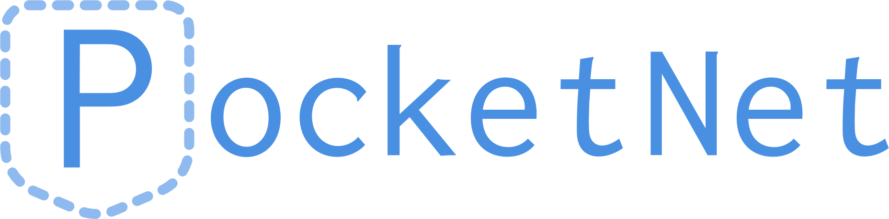

<p align="center">
	<br />
</p>

[](https://img.shields.io/cocoapods/v/PocketNet.svg)
[](http://cocoapods.org/pods/PocketNet)

## PocketNet

Elegant net abstraction layer written in Swift 4.0, we provide an integration with Alamofire.

## Requirements

- iOS 9.0+ 
- Swift 4.0+

## Installation

### CocoaPods

[CocoaPods](http://cocoapods.org) is a dependency manager for Cocoa projects. You can install it with the following command:

```bash
$ gem install cocoapods
```

> CocoaPods 1.1+ is required to build PocketNet 1.3.1

To integrate PocketNet into your Xcode project using CocoaPods, specify it in your `Podfile`:

```ruby
source 'https://github.com/CocoaPods/Specs.git'
platform :ios, '9.0'
use_frameworks!

target '<Your Target Name>' do
    pod 'PocketNet'
end
```

Then, run the following command:

```bash
$ pod install
```

## Usage

```swift
import PocketNet

let net: PocketNet = PocketNetAlamofire() /*or for SSL Pinning*/ PocketNetAlamofire(pinningSSLCertURL: Bundle.main.url(forResource: "cert", withExtension: "crt"), domain: "urlDomain")
    
let netSupport = NetSupport(net: net)

let request = NetRequest.Builder()
            	.method(.post)
                .url("url")
                .requestHeader([:])
                .parameterEncoding(.json)
                .body(params: "")
                .shouldCache(false)
                .build()

netSupport.netJsonMappableRequest(request, completion: {(result: Result<ConvertibleObject, Error>) in
	switch result {
	case .success(let convertibleObject):
		/// do something with convertibleObject
	case .failure(let error):
	    /// do something with error
	}
})
```

## Authors

* [Jose Antonio Garcia](https://github.com/joseantoniogarciay), joseantoniogarciay@gmail.com
* [Omar Megdadi](https://github.com/NSStudent), omarmn83@gmail.com

## Special thanks

* [Alex Rupérez](https://github.com/alexruperez), contact@alexruperez.com
* [Carlos Manzanas](https://github.com/IGZCarlosManzanas)
* [Roberto Estrada Casarrubios](https://github.com/RobertoEstrada)

## Libraries used in this project

* [Alamofire][1]
* [ResponseDetective][2]
* [Result][3]


## License

Net is available under the MIT license. See the LICENSE file for more info.


[1]: https://github.com/Alamofire/Alamofire
[2]: https://github.com/netguru/ResponseDetective
[3]: https://github.com/antitypical/Result
